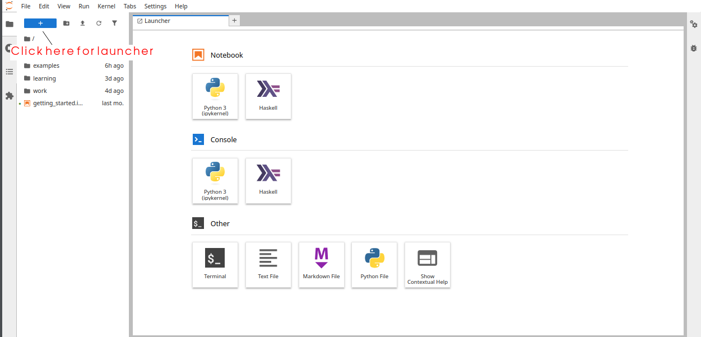
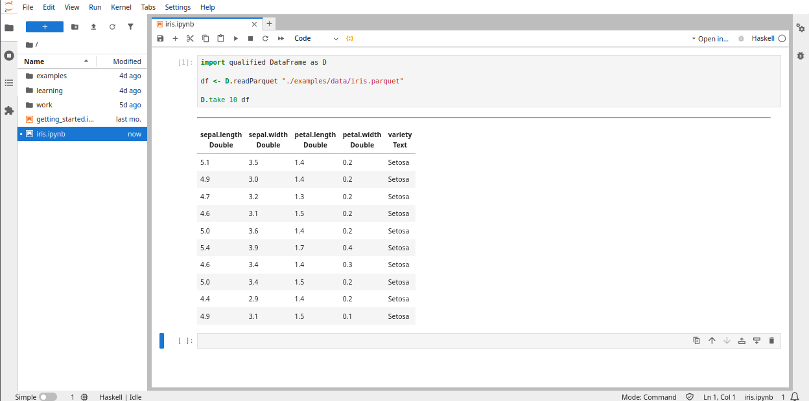
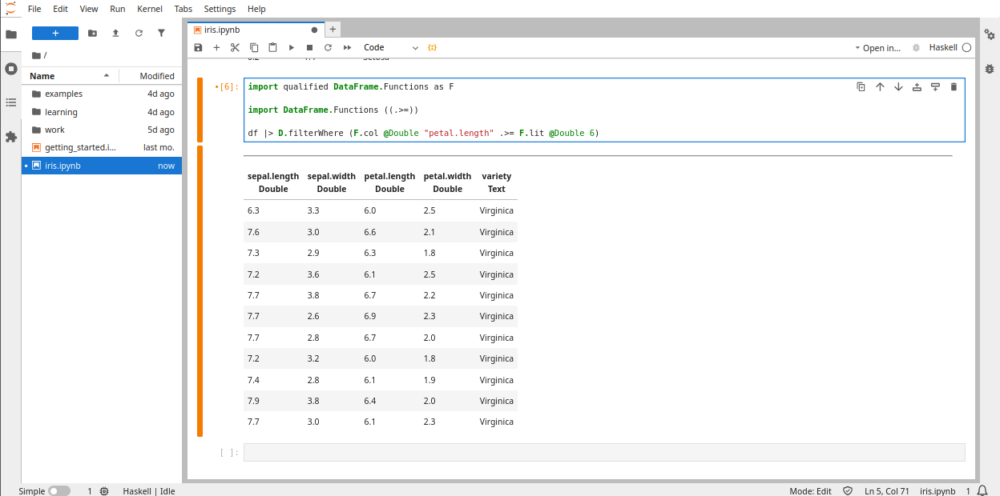
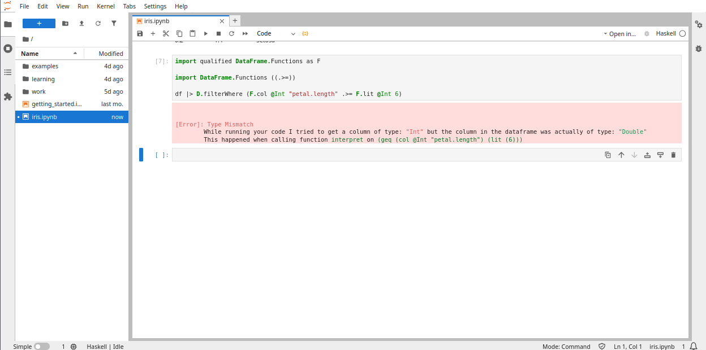
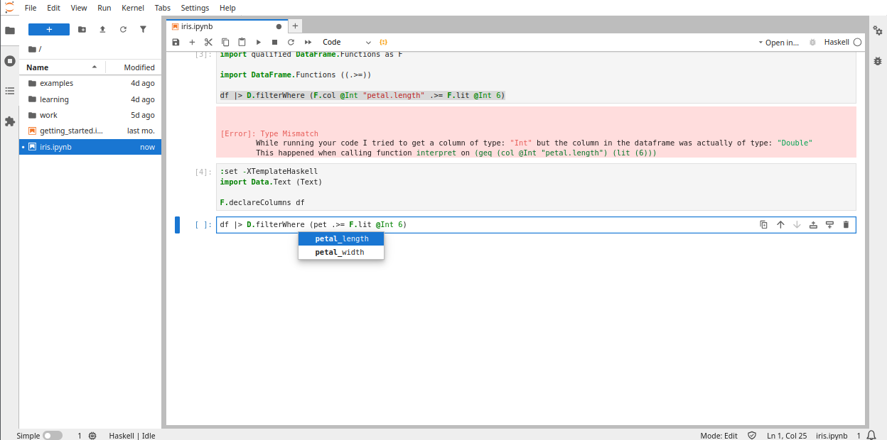
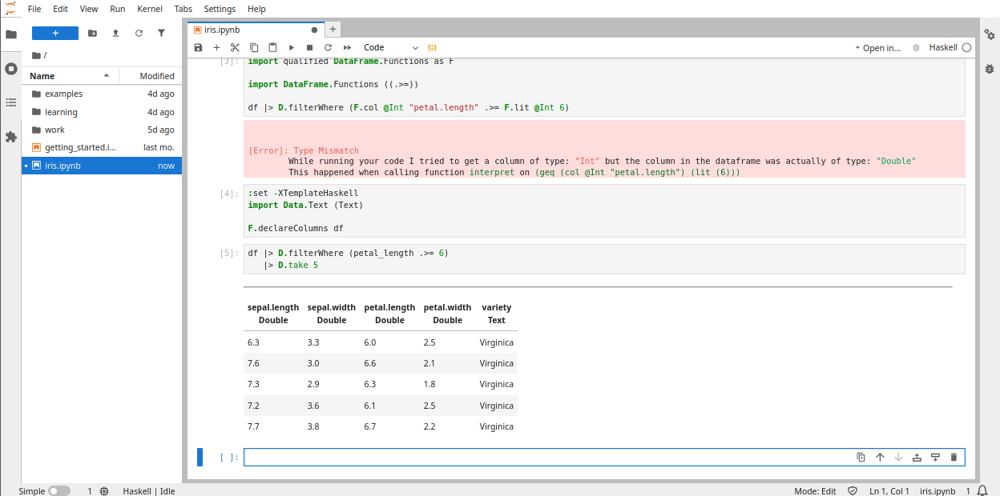
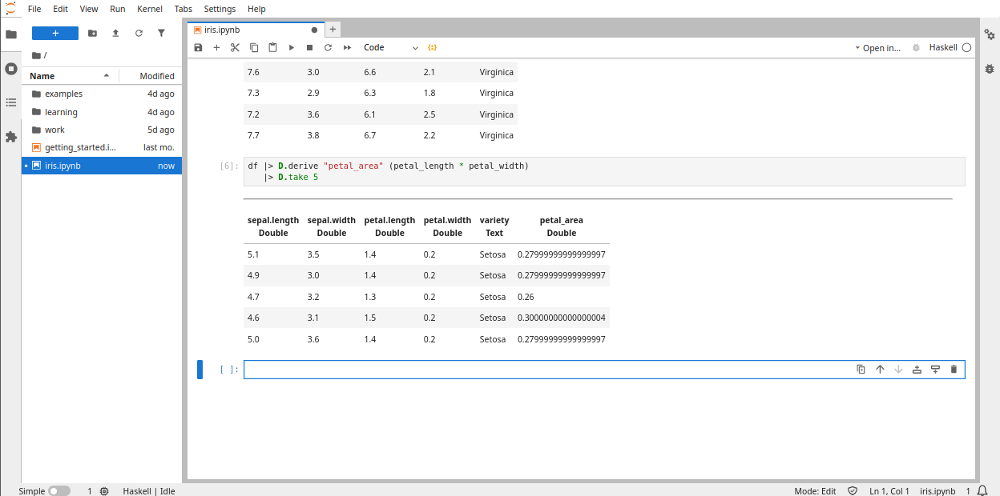
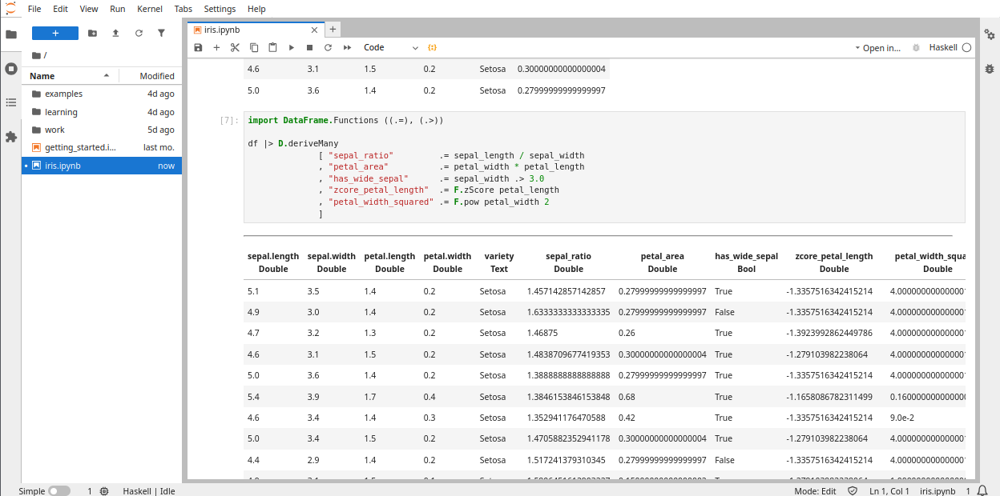
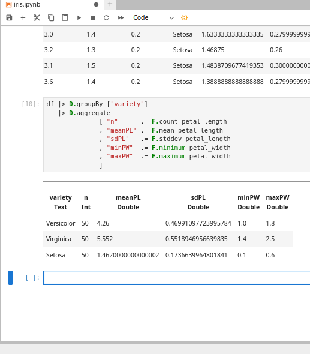
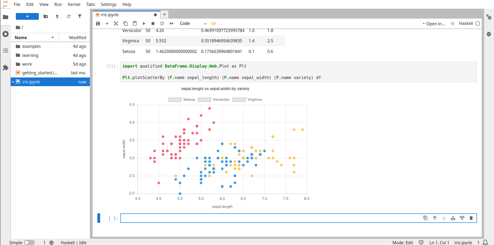

# Tutorial: Your first analysis with `dataframe` (Iris)

> A hands‑on, copy‑paste‑friendly tour of the **dataframe** ecosystem.

By the end of this tutorial you will have:

- loaded `iris.parquet` into a `DataFrame`
- inspected columns and rows
- filtered to a subset of rows
- derived a few new columns using typed expressions (`Expr a`)
- grouped + aggregated columns
- made a quick plot
- written results back out to CSV

We'll be using a notebook for this tutorial. So load up a notebook interface anyway you prefer:
* through the [datahaskell playground](https://ulwazi-exh9dbh2exbzgbc9.westus-01.azurewebsites.net/lab?).
* through [binder](https://mybinder.org/v2/gh/mchav/ihaskell-dataframe/HEAD) - this takes some time to load/build the environment.
* Or you can run the docker image locally by following the QuickStart instructions.

All three ways already come pre-loaded with the dataframe environment.

---

## 1) Load Iris and verify the shape



Select the `Haskell` in the notebook tab. This should open a new, untitled notebook file. Save this file as `iris.ipynb`.

You can see the status of the Haskell kernel on the bottom left. That's it - we are ready to get to work! 

Let's start by reading the data and showing the first 10 rows.



## 2) Select the columns you care about
In early exploration, selecting a few columns makes everything easier to read.

Let's, for some time, just look at the petal columns.


We introduce two new concepts here.

Firstly, because Haskell has many different kinds of strings we turn on the `OverloadedStrings` extension so we can use them equally in all contexts.

We also import the "chaining" operator which allows us to write operations such that the result of the previous operation is applied to the next. So instead of writing:

```haskell
D.take 5 (D.select ["petal.width", "petal.length", "variety"] df)
```

In the example above we first select the three columns from the dataframe. Then, the outer function `take 5` retrieves only the first 5 rows.

We can rewrite this with chaining as follows:

```haskell
df |> D.select ["petal.width", "petal.length", "variety"]
   |> D.take 5
```

This says:
* start with the dataframe,
* pass it to the end of the select function
* take that result and pass it to the end of the take function.

This is a common idiom in languages like R and Julia, where it's sometimes called piping.

## 3) Filter rows with typed predicates

Let's say we want to filter all flowers whose petal width is greater than 6. We can use the `filterWhere` function. `filterWhere` takes a boolean expression (`Expr Bool`). Dataframes have an expression syntax (similar to Polars) that allow us to write logic on top of columns.

There are a couple of core functions we can use to define columns:

```haskell
F.col @Int "x" -- this says "I have an int column called 'x'"
F.lit @Int 5   -- this says "I have a literal value `5` that is an integer`.
```

Expressions support regular math operations:

```haskell
-- Take the value at x and add 5 to it.
-- The type of this is `Expr Int`
F.col @Int "x" + F.lit @Int 5

-- Compute the sine of the column x and add the cosine of 0.5.
-- The type of this is `Expr Double`
sin (F.col @Double "x") + cos (F.lit @Double 0.5)
```

However, for comparison operations we have a special syntax. It's all the regular logical operators preceded by a `.`.

```haskell
-- Is x greater than 5?
-- The type of this is `Expr Bool`
F.col @Int "x" .>= F.lit @Int 5
```

The expression language eliminates a class of bugs from column operations (like adding a string to an integer).

Armed with this knowledge, we can go back and filter all flowers with petal length greater than 6.

We can see from the sample we printed before that `petal.length` is of type `Double`. We write the expression as follows:



Suppose we write out the wrong types in the expression. That is suppose we say that `petal.length` is a `Int` instead. This will cause a runtime failure:



A typo like `petal_length` would also cause the same sort of runtime failures. We'd ideally like to catch these kinds of errors earlier so we don't have unexpected failures while running a long pipeline.

We can ask Haskell to generate the correct references and use them without fear. The `declareColumns` function does exactly that. It takes the column name and creates a variable with the column name as an all lowercase string, with all special characters replaced with underscores.

In our case `petal.width` becomes `petal_width` or if it were `Petal Width (cm)` it would become `petal_width_cm_`.

Once we run `declareColumns` (which requires `TemplateHaskell` to be enabled) we get the column names as completion options in the notebook.



In fact, we can make this event shorter. Since Haskell knows how to create any num instance from literals, we don't have to write `F.lit @Int 6`. It knows, from the context, to wrap `6` so it's an `Expr Int`. Thus, we can write:



## 4) Derive new columns (your first "feature engineering" step)

You’ll often want new columns that are:

* arithmetic combinations (ratio, area),
* boolean flags, or,
* normalized features (zScore)

We can use the `derive` function which takes a column name and an expression. It will evaluate the expression and put the results in a new column with the given name. Again, our type-safe column references make this code safer and easier to write.



We can also derive many columns at once using a variant called `deriveMany`.



## 5) User defined functions

You can also use custom Haskell functions to manipulate dataframe columns.
Say you had the following Haskell function that takes in the petal length and bucketizes it.


If we wanted to apply a function that takes in two variables to our columns we would use the `lift2` function. For example, we can define `petal_area` as `"petal_area" .= F.lift2 (*) petal_width petal_length`.

## 7) Group + aggregate (summary stats per species)

Let's create a "report" that computes counts and basic stats per group.

We use the `groupBy` to group by some columns and we use `aggregate` to combine column values.



Leaving a column unaggregated causes a runtime error:

```haskell
df |> D.groupBy ["variety"]
   |> D.aggregate ["some_random_thing" .= petal_width]
```

All base columns should be aggregated in the final aggregation expression.

## 8) A simple scatter plot

We can show the sepal width and length by variety with the following terminal plot:



## 9) Save outputs you can share or reuse

Add the following to the end of your notebook:

```haskell

df2 = df |> D.groupBy ["variety"]
         |> D.aggregate
                     [ "n"      .= F.count petal_length
                     , "meanPL" .= F.mean petal_length
                     , "sdPL"   .= F.stddev petal_length
                     , "minPW"  .= F.minimum petal_width
                     , "maxPW"  .= F.maximum petal_width
                     ]
D.writeCsv "out/report.csv" df2
```

Run and check that the CSV exists.
